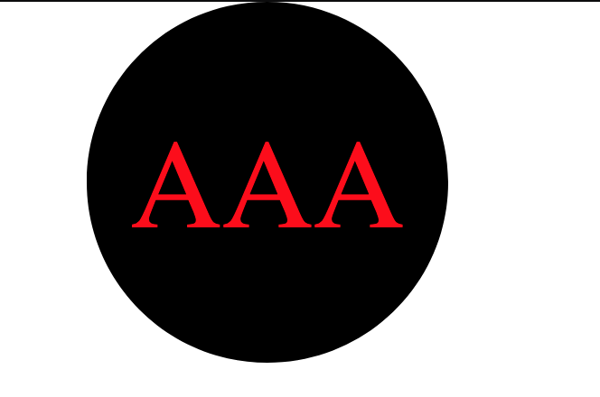
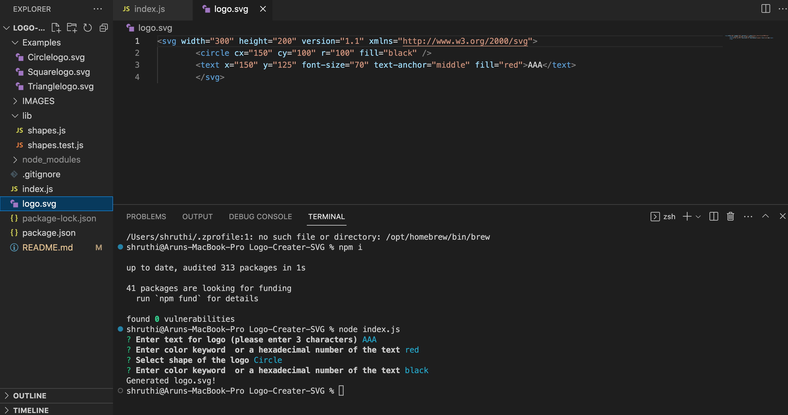
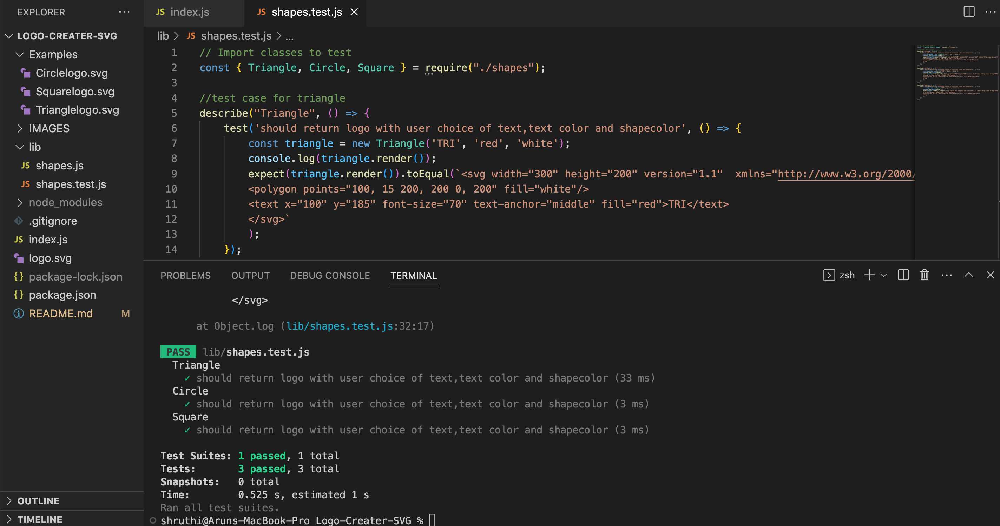

# Logo-Creater-SVG  
Object-oriented Programming Challenge: SVG Logo Maker

## Description 
The application enables users to generate a logo "logo.svg" file with the input of text(3 characters),text color,choice of shape(circle, triangle and square) and shape color.

## Table of contents :
  * [Installation](#installation)
  * [Usage](#usage)
  * [License](#license)
  * [Contributors](#contributors)
  * [Test](#test)
  * [Questions](#questions)

## Task 
Your task is to build a Node.js command-line application that takes in user input to generate a logo and save it as an SVG file. The application prompts the user to select a color and shape, provide text for the logo, and save the generated SVG to a .svg file.

## User Story 
AS a freelance web developer
I WANT to generate a simple logo for my projects
SO THAT I don't have to pay a graphic designer

## Acceptence Criteria
GIVEN a command-line application that accepts user input
1. WHEN I am prompted for text
THEN I can enter up to three characters
2. WHEN I am prompted for the text color
THEN I can enter a color keyword (OR a hexadecimal number)
3. WHEN I am prompted for a shape
THEN I am presented with a list of shapes to choose from: circle, triangle, and square
4. WHEN I am prompted for the shape's color
THEN I can enter a color keyword (OR a hexadecimal number)
5. WHEN I have entered input for all the prompts
THEN an SVG file is created named `logo.svg`
AND the output text "Generated logo.svg" is printed in the command line
6. WHEN I open the `logo.svg` file in a browser
THEN I am shown a 300x200 pixel image that matches the criteria I entered.

## Installation

1. Install NODE.js to run this application
2. Create a .gitignore file and include node_modules/ and .DS_Store/ so that your node_modules directory isn't tracked or uploaded to GitHub. Be sure to create your .gitignore file before installing any npm dependencies.
3. Make sure that your repo includes a package.json with the required dependencies. You can create one by running npm init when you first set up the project, before installing any dependencies.
4. Run command npm i inquirer@8.2.4 from the integrated terminal to install inquirer.js package dependency.
5. Run command npm install --save-dev jest to install jest for testing purpose.
5. The application will be invoked by using the following command: node index.js.

## Usage 

1. With the application invoked, you'll be prompted to answer a series of questions from the command line to generate a logo.svg for your project.
2. The questions for this application are located in the index.js file of this repository.
3. Enter after answering each question to continue to the next prompt. When all the prompts are completed, a logo.svg file will automatically generated. 
4. Open the logo.svg file to view the results in the live server/browser. 

## License  
* This application is licensed under : 
* Click the link for the detailed license information: https://choosealicense.com/licenses/mit/

## Contributors
shruthi

## Test
npm test

## Questions
  * GitHub Username : shruthisalimath
  * Email: shruthi@test.com
  * GitHub profile : https://github.com/shruthisalimath 

## Mock Up

## URL
 1. A walkthrough video demonstration. 
 [LOGO MAKER VIDEO]
 (https://drive.google.com/file/d/14Y2jS5QGDuuLgbfXXgw1D_knGviYoy3F/view?usp=share_link)

 2.The URL of the GitHub repository.
 https://github.com/shruthisalimath/Logo-Creater-SVG

 ## ScreenShot

## Sample Logo generator
* [Sample Circle Logo](./IMAGES/Sample-circle-logo.png)
* [Sample Square Logo](./IMAGES/Sample-square-logo.png)
* [Sample Triangle Logo](./IMAGES/Sample-triangle-logo.png)
 

